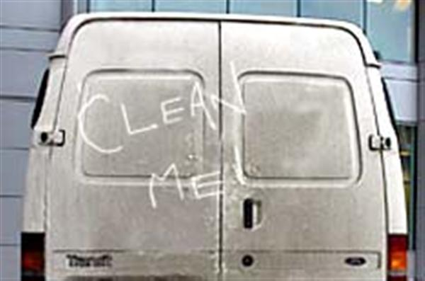
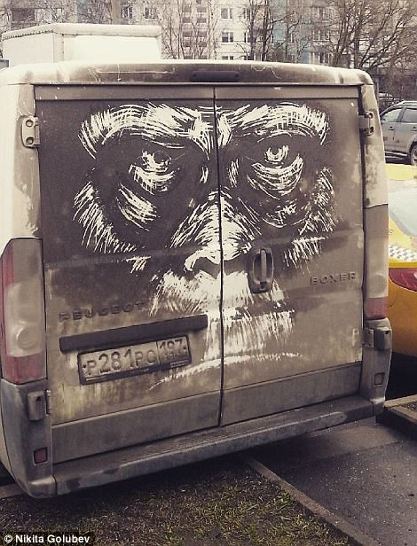
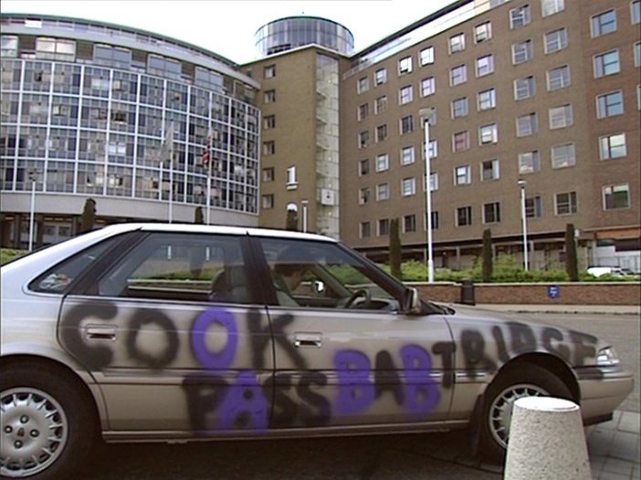

Yesterday I saw a white van with 'clean me' scrawled rapidly in the dirt on the back door. Something like this (I didn't take a photo):

I haven't seen this in ages! I thought it had just gone out of fashion. Perhaps vans are just cleaner these days.

This reminded me of something I'd seen on the internet (of course). If you search for 'dirty van art', you'll see there's a whole subculture of 'grafilthy' art, like this Gorilla by Nikita Golubev:

Not bad.

Although the medium is the same, the message is very different here.

In the original case, the 'artwork' remains deliberately unattributed. The intention is to make it a little embarrassing to drive around in a vehicle like that. It's a 'laugh'. But it's not exactly vandalism, unlike this:

(Please excuse the Alan Partridge Reference if you're not familiar with it.)

In the case of the gorilla, the work is attributed and presents a different message. It reminds me of the debate around graffiti art that raged in the 80s. Is it art? Should it be removed? When Banksy emerged from this movement and started using stencilling, the debate flared up again.

In many cities now graffiti art is sanctioned, licensed, regulated and funded as part of civil life. Barcelona and Berlin come to mind.

Small acts of 'vandalism' can occur in software engineering too.

If lots of people work on a single code base, it is in the interests of the business to keep things as consistent as possible.

But developers don't always like this. We want to express ourselves. So sometimes we rebel a bit and go against the prevailing doctrine. We like to sneak in a different approach or a unusual pattern.

I don't necessarily see this as a problem. It's less like Alan Partridge's car and more like the 'clean me' phenomenon. It's temporary and reversible if it's really causing a problem. After all, we're paid to be creative.

However, we should aim to make these contributions more like that gorilla and less like a passive aggressive message scrawled opportunistically in passing.

After all, as Banksy has shown, what starts out as an 'eyesore' can be transformed into a valuable work of high art, purely through the act of influencing others.

I want your confessions! __What acts of deliberate 'code vandalism' have you committed?__ I'll share any confessions I get (anonymously).

All the best,

-- Jim
