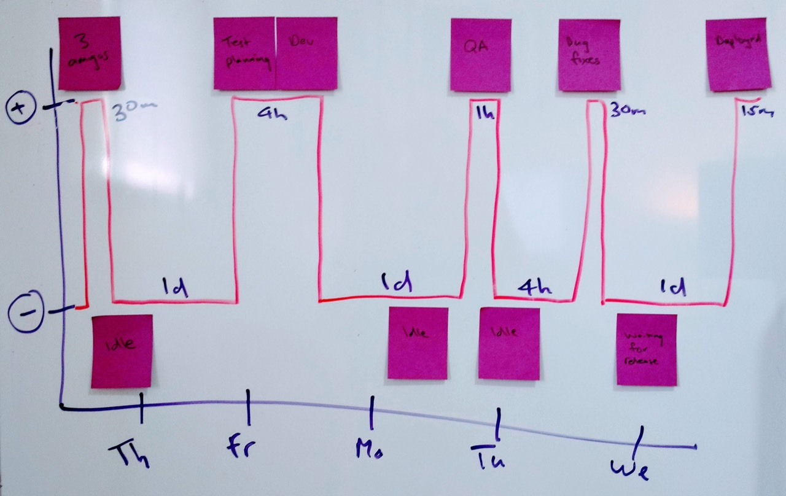

If you want to help your team identify and tackle waste in your development flow, here's a simple technique you can use in a retrospective:

1. Identify a handful of recent features or user stories that have been 'done' (for whatever your definition of done is). Three or four should be enough, but try to get a range of story types.
2. For each user story / feature, put up a large sheet of paper or use a white board and draw x- and y-axes.
3. On your y-axis mark only two values: 'adding value' and 'waste'.
4. On your x-axis add a mark for each working day the feature was in progress from conception to 'done'. This might be one sprint, or it could be a large feature that spread across multiple sprints.
5. Now, as a team, write all the steps and states that the feature went through on its journey to 'done' on sticky notes. Create a separate note for each step. Make sure you include everything. You should include all the 'value added' stages like active development, unit testing, user research and design work. But you should also include all the wasteful and unnecessary steps where the feature was not being worked on ('idle'), being unblocked or otherwise being managed.
6. Discuss whether each state represented directly adding value for users or not. There is bound to be some disagreement, but these conversations are important. Don't be tempted to have a third 'maybe adding a bit of value' state. That's just fence-sitting.
7. Place the stickies in the order that they occurred on the graph - at the top of the y-axis if they added value; or at the bottom if they didn't.
8. Draw a sawtooth timeline representing the transition from value-added to wasteful states over time
9. Write the approximate amount of time the feature was in each state.
10. Repeat for the other features / user stories

You should end up with charts that look something like this:

This shows a simplified timeline for a small feature that was one of many cards in a week-long sprint. You can see that the amount of time spent on development and testing was quite low, but it took the whole sprint to get to users because there was a lot of time where it was not being worked on.

The next step is to identify common problems across different features and discuss the causes of these wasteful periods with your team. Finally, this is a retrospective exercise, so you'll want to identify actions or experiments you can carry out to shorten them.

In the case of the feature above, much of the waste is down to many features being worked on in parallel, and everything being released in a big batch at the end of the sprint.

I'll leave it up to you as an exercise to think about possible approaches for reducing waste for this team.

I've found this exercise to be incredibly useful for product teams as it clearly visualises some of the common issues that come up in retrospectives anyway, but with a visual aid for constructive discussions.

All the best,

-- Jim
