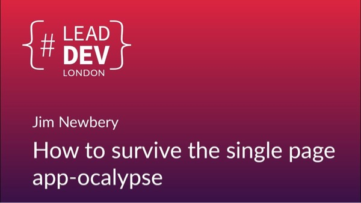

You can now [watch my talk from The Lead Dev London](https://www.youtube.com/watch?v=1SRO-1HBE6E) about the hidden costs of single page apps and how product organisations can learn how to live with them. Go on, it's less than 15 minutes long.

Don't forget to [check out the other amazing talks](https://www.youtube.com/playlist?list=PLBzScQzZ83I_VX8zgmLqIfma_kJs3RRmu) too while you're there.

If you do watch the talk, I'd love you to reply and let me know what you think.

And if you enjoyed it, please share it far and wide on your social medium of choice.

All the best,

-- Jim
